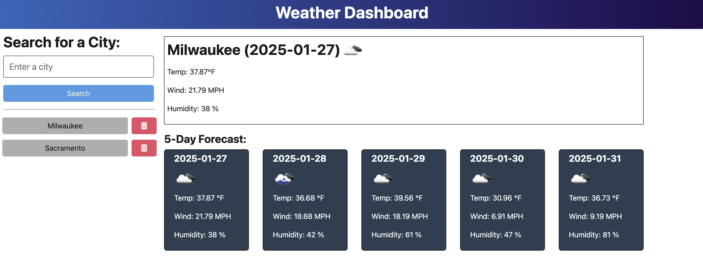

# API Weather Dashboard


## Description 
The code provided in this repository builds a website that calls an API using serverside programming and TypeScript to properly indicate value types of objects recieved. A user will be able to input any major city in the U.S. and display a forecast for the next 5 calendar days that will include Temperature, Wind Speed, and Humidty. There is also a removeCity() method that allows the user to delete search history from the searchHistory.json file using the DELETE HTTPS request. 

## Table of Contents 
* [Description](#description)
* [Instructions](#instructions)
* [Technologies](#technologies)
* [Contribution](#contribution)
* [License](#license)
* [Links](#links)
* [Questions](#questions)

## Instruction
Using the command(s) provided, you can clone the repository into your local environment and test the program locally instead of the Render website service. 

```bash
npm i 
```


```bash
npm run start:dev
```

See image below for an example site: <br>
 <br>

## Technologies
* JavaScript
* TypeScript
* Node.js
* Render
* OpenWeather API

## Contribution
XPert Learning Assistant, Full Stack Forum, Tutoring sessions with Alexis Javier and assistance during office hours from TA's

## License
This project is licensed under the MIT License

## Links
* [GitHub Repository](https://github.com/jaornelas/apiweather-dash)
* [Weather Dashboard Website](https://www.apiweather-dash.onboard.com)


## Questions 
If you have any additional questions about the project, please feel free to raach me at: 
- GitHub [jaornelas](https://github.com/jaornelas)
- E-Mail [ornelalf001@gmail.com](mailto:ornelalf001@gmail.com)
